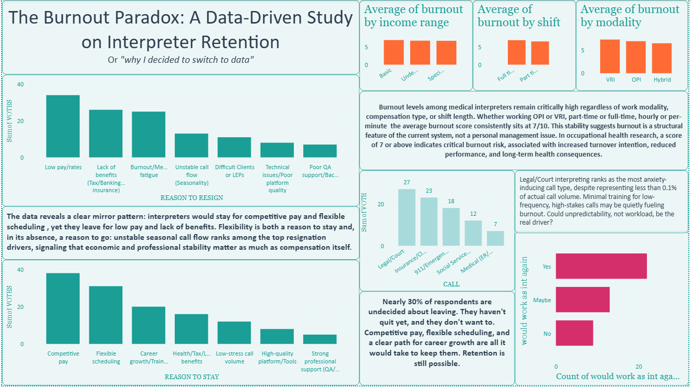
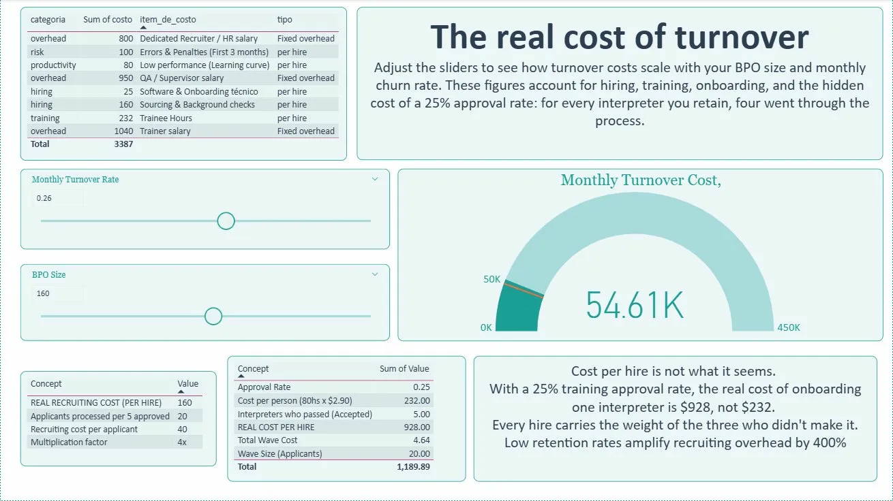
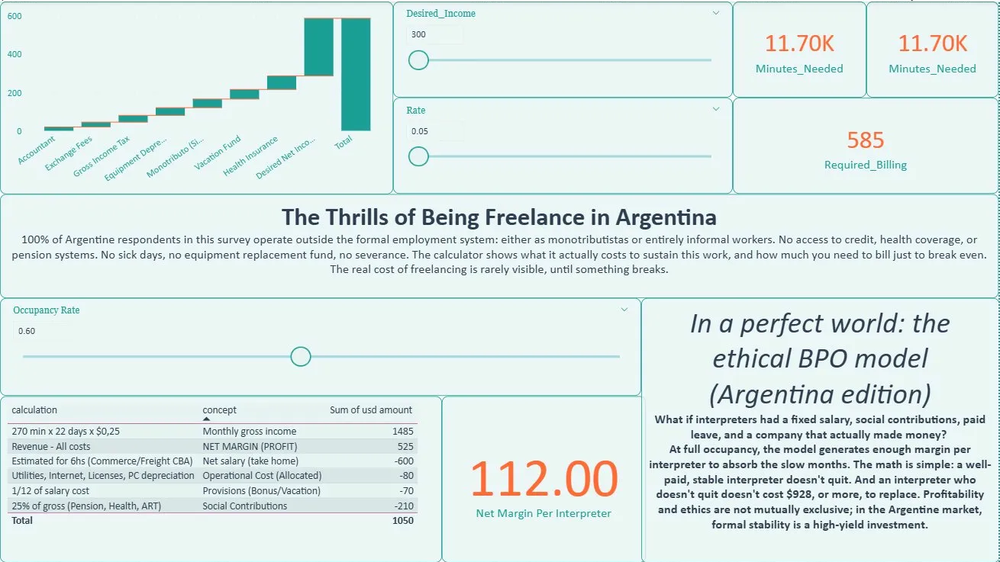
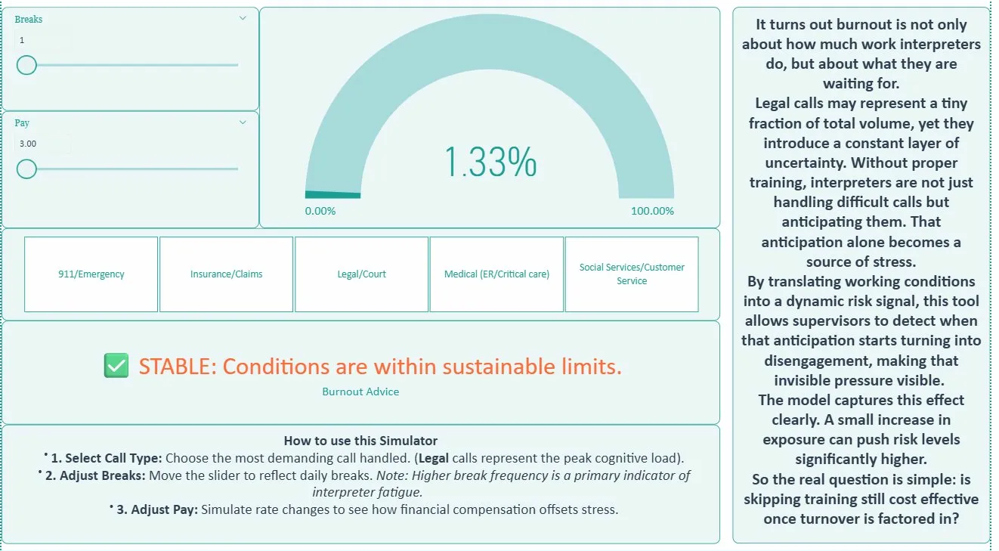

# The Burnout Paradox: A Data-Driven Study on Interpreter Retention

> *"Or why I decided to switch to data."*

A 4-page interactive Power BI dashboard exploring burnout, turnover costs, and financial sustainability among freelance medical interpreters - built from a real survey, real operational experience, and a logistic regression model trained on augmented data.

---

## Background

This project started with a feeling. After years working as a freelance medical interpreter on OPI/VRI platforms, I noticed a pattern: high-performing interpreters were leaving, and the reasons went beyond low pay. I wanted to know whether the data confirmed what I was experiencing firsthand.

I designed and distributed a survey targeting medical interpreters, shared across interpreter communities on Reddit and other platforms. The responses became the foundation of this dashboard.

---

## Dashboard Overview

### Page 1 - The Burnout Paradox



Explores why interpreters stay and why they leave, using survey responses on resignation drivers and retention factors.

**Key finding:** The data reveals a mirror pattern - interpreters would stay for competitive pay and flexible scheduling, yet they leave for exactly the opposite. Flexibility is both a reason to stay and, in its absence, a reason to go. Burnout scores remain consistently at 7/10 regardless of work modality, compensation type, or shift length. In occupational health research, a score of 7 or above indicates critical burnout risk associated with increased turnover intention and long-term health consequences. This suggests burnout is a structural feature of the current system, not a personal management issue.

**Visuals:** Bar charts (reasons to resign / reasons to stay), small multiples for burnout by income range, shift type, and modality, pie chart by call type, donut chart for turnover intention.

---

### Page 2 - The Real Cost of Turnover



A financial model of what interpreter turnover actually costs a BPO operation, with interactive sliders for team size and monthly churn rate.

**Key insight:** With a 25% training approval rate, the real cost of onboarding one interpreter is $928 - not the $232 training cost that appears on paper. Every hire carries the weight of the three who didn't make it. The model accounts for hiring, sourcing, background checks, QA supervision, trainer salary, onboarding software, and a learning curve productivity dip.

**Built from:** Personal experience working as a BPO interpreter, combined with standard HR cost modeling.

**Visuals:** Cost breakdown table, gauge chart for monthly turnover cost, dynamic cost-per-hire calculator.

**Interactive sliders:** BPO size and monthly churn rate - all cost figures scale dynamically.

---

### Page 3 - The Thrills of Being Freelance in Argentina



A freelance sustainability calculator showing what Argentine interpreters actually need to bill just to break even - accounting for the hidden costs that formal employment would otherwise cover.

**Context:** 100% of Argentine respondents in the survey operate outside the formal employment system - as monotributistas or entirely informal workers. No access to credit, no health coverage through an employer, no pension, no sick days, no equipment replacement fund, no severance. A broken computer or a medical emergency can destabilize months of income.

**The calculator includes:**
- Monotributo (Category B/C)
- Gross income tax (IIBB, ~3.5%)
- Health insurance (Obra Social / Prepaga)
- Accountant fees
- Equipment depreciation (PC / Headset)
- Vacation fund (proportional)
- Exchange / withdrawal fees

**Waterfall chart** shows how each cost stacks onto the desired net income to reach the required billing total. Sliders for desired net income (USD) and per-minute rate update all figures in real time.

The ethical BPO model includes an additional **occupancy rate slider** - showing how net margin per interpreter scales with platform utilization, and at what occupancy point the model becomes profitable.

Also included: a model for an **ethical BPO** that provides Argentine interpreters with a fixed salary, social contributions, and paid leave - and still generates profit at occupancy rates above 50%.

**DAX highlights:**
```
Dynamic_Amount = 
SWITCH(
    SELECTEDVALUE(Freelance_Costs_Final[Category]),
    "Desired Net Income", [Desired_Income Value],
    SUM(Freelance_Costs_Final[Monthly_cost])
)

Required_Billing = 
    [Operative_Cost] + SELECTEDVALUE('Desired_Income'[Desired_Income], 800)

Minutes_Needed = DIVIDE([Required_Billing], [Rate Value 2])
Hours_Needed = DIVIDE([Minutes_Needed], 60)
```

---

### Page 4 - Burnout Risk Simulator



An interactive tool that simulates an interpreter's burnout risk score based on call type, number of breaks, and pay rate - designed to help supervisors detect early disengagement signals before they become turnover.

**Model logic:** Each call type is assigned a stress weight based on cognitive load and unpredictability. Legal/Court calls, despite representing less than 0.1% of total call volume, rank as the highest anxiety-inducing category. The model captures the effect of anticipatory stress - interpreters are not just handling difficult calls, they are waiting for them.

**Built with:** Python (scikit-learn), logistic regression trained on real survey data augmented with synthetic observations to improve model stability. Stress scores per call type assigned from domain knowledge as a practicing interpreter.

**Interactive sliders:** Call type selector, number of daily breaks, and pay rate - the model recalculates the burnout risk score in real time as conditions change. Break frequency is treated as a primary indicator of fatigue.

**Output:** Risk gauge (0–100%) with a plain-language assessment (Stable / At Risk / Critical) and contextual advice.

---

## Technical Stack

| Tool | Use |
|---|---|
| Power BI Desktop | Dashboard, DAX modeling, all visuals |
| Power Query (M) | Data cleaning, table transformations, append queries |
| DAX | Dynamic measures, parameter-driven calculations |
| Python / scikit-learn | Logistic regression burnout model (Page 4) |
| Google Sheets | Original survey data collection and cleaning |
| Jupyter Notebook | Model development and testing |

---

## Data Sources

- **Primary:** Original survey distributed to medical interpreter communities (Reddit and interpreter networks). Responses collected anonymously.
- **Augmented:** Synthetic data generated to supplement small-N categories in the logistic regression model, clearly documented in the notebook.
- **Operational data:** BPO cost structures and freelance expense categories derived from personal professional experience as an interpreter and platform worker in Argentina.

---

## About

Built by **Mailén Silva Ahijado**, freelance medical interpreter (OPI/VRI), English educator, and data analytics learner based in Argentina.

This project sits at the intersection of three things: a profession I know from the inside, a country whose labor conditions are rarely visible in global remote work conversations, and a new technical skillset I am actively building.

[LinkedIn](#) · [@voxclinicaclasses](#)
